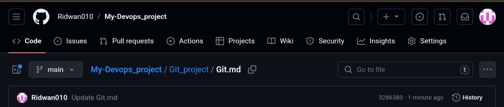
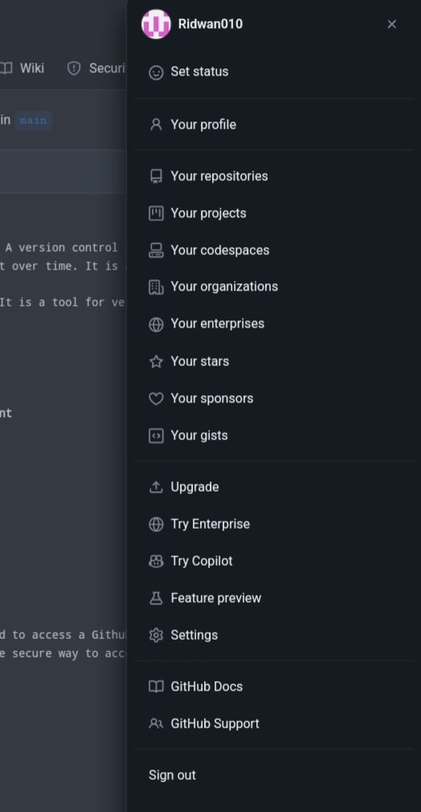
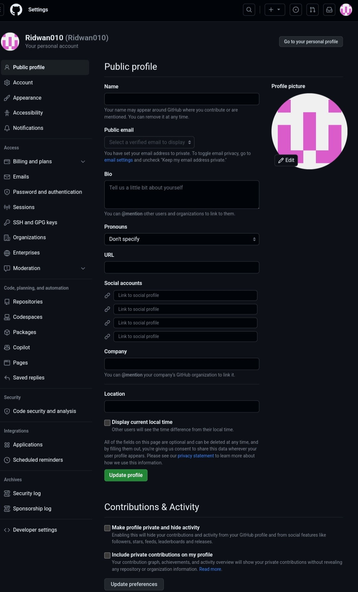
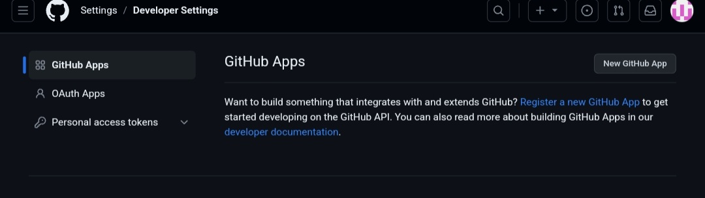
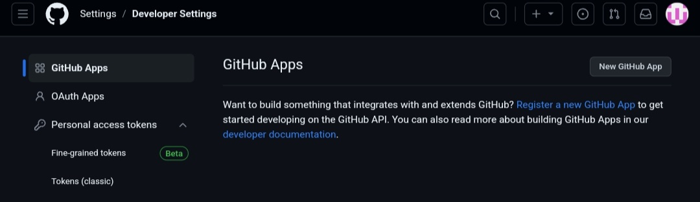
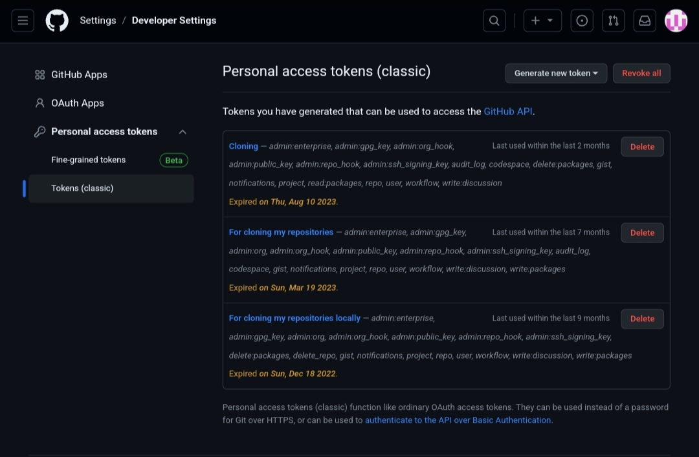

# Git & Github 
### What is Git ? 🤔
The simple definition is that it is a version control system. A version control system is a software tool that helps manage and track changes to files and directories in a project over time. It is a crucial tool for devops engineers.
### What is Github.
 Github is a code repository when all code changes are kept. It is a tool for version control and increases collaboration among cross functions team.

# Implementation of Git & Github
### Creating a Github account
click [here](https://github.com) to create an account 
### Installing Git in your virtual machine, for example vagrant
Update apt repositories 

       sudo apt update 
Install git 
      
       sudo apt install git 
Confirm installation of git by running the below command

       git --version 

### Creating a personal access token (PAT)
Personal Access Token is a form of authentication that is used to access a Github account from the command line using Git. It give access to repository locally and server as a more secure way to access a github account by replacing the username and password.

Click on the top right corner

Select settings from dropdown

Select Developer Settings

Select personal access token 

Select Token(classic)

Click on Generate new token to generate a new one

Your PAT should be stored safely and cannot be shared with anyone. Store somewhere you can only access it once after it is generated.
